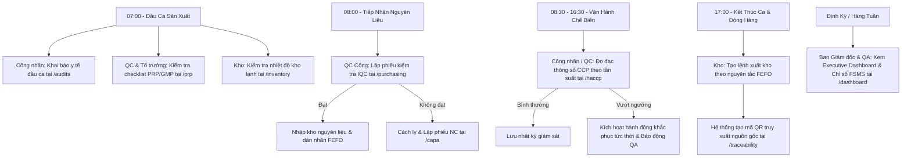

# SỔ TAY HƯỚNG DẪN SỬ DỤNG HỆ THỐNG WCERT FSMS AI PLATFORM
### Hệ Thống Số Hóa Quản Lý An Toàn Thực Phẩm Toàn Diện Theo Chuẩn ISO 22000:2018

---

## MỤC LỤC
1. [Giới Thiệu Tổng Quan](#1-giới-thiệu-tổng-quan)
2. [Hướng Dẫn Đăng Nhập & Phân Quyền (RBAC)](#2-hướng-dẫn-đăng-nhập--phân-quyền-rbac)
3. [Hướng Dẫn Chi Tiết 14 Phân Hệ Nghiệp Vụ](#3-hướng-dẫn-chi-tiết-14-phân-hệ-nghiệp-vụ)
   - [3.1. Dashboard Điều Hành & Quản Trị](#31-dashboard-điều-hành--quản-trị-dashboard)
   - [3.2. Bối Cảnh Tổ Chức & Đội Ngũ ATTP](#32-bối-cảnh-tổ-chức--đội-ngũ-attp-organization)
   - [3.3. Hệ Thống Kiểm Soát Tài Liệu DMS](#33-hệ-thống-kiểm-soát-tài-liệu-dms-documents)
   - [3.4. Quản Lý Sự Thay Đổi](#34-quản-lý-sự-thay-đổi-change-management)
   - [3.5. Nhà Cung Cấp & Kiểm Nghiệm Đầu Vào IQC](#35-nhà-cung-cấp--kiểm-nghiệm-đầu-vào-iqc-purchasing)
   - [3.6. Kế Hoạch HACCP & Giám Sát CCP/oPRP](#36-kế-hoạch-haccp--giám-sát-ccpoprp-haccp)
   - [3.7. Chương Trình Tiên Quyết PRP / GMP / SSOP](#37-chương-trình-tiên-quyết-prp--gmp--ssop-prp)
   - [3.8. Quản Lý Thiết Bị & Hiệu Chuẩn](#38-quản-lý-thiết-bị--hiệu-chuẩn-equipment)
   - [3.9. Quản Lý Kho Lạnh & Nguyên Tắc FEFO](#39-quản-lý-kho-lạnh--nguyên-tắc-fefo-inventory)
   - [3.10. Truy Xuất Nguồn Gốc & Thu Hồi Giả Định](#310-truy-xuất-nguồn-gốc--thu-hồi-giả-định-traceability)
   - [3.11. Sự Không Phù Hợp & Hành Động Khắc Phục CAPA](#311-sự-không-phù-hợp--hành-động-khắc-phục-capa-capa)
   - [3.12. Đánh Giá Nội Bộ, Đào Tạo & Khai Báo Sức Khỏe](#312-đánh-giá-nội-bộ-đào-tạo--khai-báo-sức-khỏe-audits)
   - [3.13. Ứng Phó Tình Huống Khẩn Cấp](#313-ứng-phó-tình-huống-khẩn-cấp-emergency)
   - [3.14. Studio Biểu Mẫu & Lưu Đồ Động](#314-studio-biểu-mẫu--lưu-đồ-động-builder)
4. [Kịch Bản Vận Hành Mẫu Trong Một Ngày Làm Việc](#4-kịch-bản-vận-hành-mẫu-trong-một-ngày-làm-việc)
5. [Các Câu Hỏi Thường Gặp (FAQ) & Xử Lý Sự Cố](#5-các-câu-hỏi-thường-gặp-faq--xử-lý-sự-cố)

---

## 1. GIỚI THIỆU TỔNG QUAN

**WCERT FSMS AI Platform** là giải pháp phần mềm chuyên biệt giúp doanh nghiệp chế biến và sản xuất thực phẩm chuyển đổi số toàn diện Hệ thống Quản lý An toàn Thực phẩm theo chuẩn quốc tế **ISO 22000:2018**.

### Điểm nổi bật của hệ thống:
* **Chuẩn hóa 100% theo điều khoản ISO 22000:2018:** Bao quát từ Bối cảnh tổ chức (Điều khoản 4), Sự lãnh đạo (Điều khoản 5), Hoạch định & Thay đổi (Điều khoản 6), Hỗ trợ & Tài liệu (Điều khoản 7), Thực hiện & Giám sát HACCP/PRP (Điều khoản 8), Đánh giá kết quả hoạt động (Điều khoản 9) đến Cải tiến liên tục & CAPA (Điều khoản 10).
* **Tích hợp Trí tuệ Nhân tạo (AI Assistant):** Hỗ trợ phân tích nguyên nhân gốc rễ 5-Whys, sơ đồ xương cá Ishikawa 5M, tự động sinh checklist đánh giá nội bộ, đề thi sát hạch nhân sự, và dự báo mức độ sẵn sàng chứng nhận.
* **Không độ trễ (Real-time):** Giám sát CCP theo ca sản xuất, cảnh báo vượt ngưỡng tức thời tới người phụ trách.
* **Truy xuất nguồn gốc 4 tầng:** Liên kết chặt chẽ Nhà cung cấp ➔ Lô nguyên liệu IQC ➔ Mẻ chế biến/CCP ➔ Lô thành phẩm & Khách hàng.

---

## 2. HƯỚNG DẪN ĐĂNG NHẬP & PHÂN QUYỀN (RBAC)

### 2.1. Truy cập hệ thống
* **Địa chỉ truy cập Web:** `http://localhost:8080` (hoặc tên miền nội bộ của doanh nghiệp).
* Màn hình đăng nhập sẽ hiển thị biểu mẫu xác thực cùng với **Thanh chọn vai trò nhanh (Demo Role Switcher)**.

### 2.2. Các nhóm vai trò & Tài khoản mẫu

| Vai trò | Tên đăng nhập | Mật khẩu mặc định | Trách nhiệm chính trong hệ thống |
| :--- | :--- | :--- | :--- |
| **Quản trị hệ thống (Admin)** | `admin` | `123456` hoặc `admin123` | Quản lý người dùng, phân quyền, cấu hình hệ thống, thiết kế Form & Workflow động. |
| **Ban QLCL / Đội ATTP (QA/QC)** | `qa` | `123456` hoặc `qa123` | Quản trị Kế hoạch HACCP, duyệt CCP/oPRP, kiểm tra IQC, thẩm tra CAPA, lập lịch Audit nội bộ. |
| **Phòng Sản xuất (Production)** | `production` | `123456` hoặc `prod123` | Ghi nhận nhật ký đo đạc CCP theo ca, báo cáo sự cố dây chuyền, xuất nhập kho nguyên liệu FEFO. |
| **Phòng Cơ điện / Bảo trì (Maintenance)** | `maintenance` | `123456` hoặc `maint123` | Quản lý lý lịch thiết bị, lập lịch bảo trì phòng ngừa, ghi nhận kiểm định & hiệu chuẩn thiết bị đo. |

> **Mẹo thao tác:** Bạn có thể nhấn trực tiếp vào thẻ vai trò tương ứng trên màn hình đăng nhập, hệ thống sẽ tự động điền thông tin đăng nhập mà không cần nhập tay.

---

## 3. HƯỚNG DẪN CHI TIẾT 14 PHÂN HỆ NGHIỆP VỤ

---

### 3.1. Dashboard Điều Hành & Quản Trị (`/dashboard`)
*Dành cho: Ban Tổng Giám đốc, Trưởng ban ISO, Đội trưởng Đội ATTP.*

#### Chức năng chính:
1. **Chỉ số sức khỏe FSMS (FSMS Health Score):**
   - Thang điểm 0 - 100% tổng hợp mức độ tuân thủ của toàn bộ 7 trụ cột ISO.
   - Nhãn xếp hạng: `EXCELLENT` (Xuất sắc), `GOOD` (Tốt), `WARNING` (Cảnh báo), `CRITICAL` (Nguy cấp).
2. **Biểu đồ Radar 7 Trụ Cột ISO 22000:**
   - Đánh giá trực quan mức độ hoàn thiện của: *Bối cảnh & Lãnh đạo, Hoạch định HACCP, Hỗ trợ & Đào tạo, Vận hành & PRP, Đánh giá Audit, Cải tiến CAPA, Chuỗi cung ứng & Truy xuất*.
3. **Trung Tâm Cảnh Báo Điều Hành (Executive Alerts):**
   - Cảnh báo các thiết bị sắp quá hạn hiệu chuẩn.
   - Cảnh báo các hành động khắc phục CAPA sắp hoặc đã quá hạn.
   - Cảnh báo các lô hàng kho lạnh sắp hết hạn sử dụng.
4. **Mục Tiêu Chất Lượng & ATTP (Quality Objectives):**
   - Theo dõi tiến độ đạt được các chỉ tiêu định lượng (Ví dụ: Tỷ lệ sản phẩm loại 1 > 98%, Tỷ lệ khiếu nại khách hàng < 0.1%).
5. **Họp Xem Xét Của Lãnh Đạo (Management Review - Điều khoản 9.3):**
   - Quản lý biên bản họp xem xét lãnh đạo định kỳ, phân công các quyết định cải tiến.
6. **Bộ Công Cụ Trí Tuệ Nhân Tạo (AI Insights):**
   - **Dự báo độ sẵn sàng đánh giá chứng nhận:** Phân tích điểm yếu và tính toán xác suất đạt chứng nhận ISO 22000.
   - **Tự động lập báo cáo xem xét lãnh đạo:** AI tổng hợp dữ liệu toàn hệ thống thành văn bản báo cáo hoàn chỉnh.
   - **Gợi ý mục tiêu chất lượng:** Đề xuất các KPI thông minh dựa trên dữ liệu vận hành thực tế.

---

### 3.2. Bối Cảnh Tổ Chức & Đội Ngũ ATTP (`/organization`)
*Áp dụng: Điều khoản 4 (Bối cảnh tổ chức) & Điều khoản 5 (Sự lãnh đạo).*

#### Các bước thực hiện:
1. **Quản lý Đội An Toàn Thực Phẩm (Food Safety Team):**
   - Bấm **"Thêm Thành Viên"** để bổ nhiệm thành viên Đội ATTP: Họ tên, phòng ban, vai trò trong đội (Đội trưởng, Đội phó, Thư ký, Thành viên), số quyết định bổ nhiệm và năng lực/bằng cấp chuyên môn.
2. **Phân Tích Bối Cảnh SWOT:**
   - Ghi nhận và đánh giá định kỳ các yếu tố: Điểm mạnh (Strengths), Điểm yếu (Weaknesses), Cơ hội (Opportunities), Thách thức (Threats).
   - Đánh giá mức độ rủi ro và giải pháp ứng phó.
3. **Các Bên Quan Tâm (Interested Parties):**
   - Danh sách kỳ vọng và yêu cầu luật định của: Khách hàng, Cơ quan Quản lý ATTP (Chi cục ATTP, Cục Thú y), Nhà cung ứng, Cán bộ công nhân viên.
4. **Chính Sách ATTP & Cam Kết Lãnh Đạo:**
   - Công bố chính sách an toàn thực phẩm, cam kết cung cấp nguồn lực và truyền thông nội bộ.

---

### 3.3. Hệ Thống Kiểm Soát Tài Liệu DMS (`/documents`)
*Áp dụng: Điều khoản 7.5 (Thông tin dạng văn bản).*

#### Cấu trúc tài liệu 4 cấp:
- **Cấp 1 - Sổ tay ATTP (Food Safety Manual):** Tài liệu khung cao nhất.
- **Cấp 2 - Quy trình chuẩn (SOP):** Các quy trình nghiệp vụ liên phòng ban (Quy trình vệ sinh, Quy trình kiểm soát CCP, Quy trình CAPA...).
- **Cấp 3 - Hướng dẫn công việc (WI):** Hướng dẫn chi tiết tại từng vị trí thao tác máy.
- **Cấp 4 - Biểu mẫu ghi chép (Forms/Records):** Các mẫu biên bản, nhật ký theo dõi.

#### Vòng đời tài liệu:
1. **Tạo tài liệu mới:** Nhập mã số tài liệu (VD: `SOP-QA-01`), tên tài liệu, phiên bản (VD: `Ver 1.0`), phòng ban ban hành, nội dung chi tiết.
2. **Trạng thái tài liệu:** `DRAFT` (Bản thảo) ➔ `UNDER_REVIEW` (Đang xem xét) ➔ `APPROVED` (Đã phê duyệt) ➔ `RELEASED` (Ban hành chính thức) ➔ `OBSOLETE` (Hết hiệu lực/Lưu trữ).
3. **In ấn & Xuất bản:** Hỗ trợ tính năng in ấn trực tiếp hoặc tải tài liệu với đầy đủ thông tin kiểm soát phiên bản.

---

### 3.4. Quản Lý Sự Thay Đổi (`/change-management`)
*Áp dụng: Điều khoản 6.3 (Hoạch định các thay đổi).*

Khi nhà máy có bất kỳ thay đổi nào thuộc nguyên tắc **4M** (*Man - Con người, Machine - Thiết bị, Material - Nguyên liệu, Method - Công nghệ/Quy trình*), bắt buộc phải lập phiếu yêu cầu thay đổi:
1. **Tạo phiếu thay đổi:**
   - Nhập tiêu đề, phân loại thay đổi (Thay đổi nhà cung cấp, thay thế thiết bị mới, thay đổi công thức phối trộn...).
   - Mô tả chi tiết lý do và phạm vi thay đổi.
2. **Đánh giá tác động ATTP (Risk Assessment):**
   - Đánh giá xem thay đổi có làm ảnh hưởng đến kế hoạch HACCP, giới hạn tới hạn CCP hay không.
3. **Phê duyệt & Giám sát triển khai:**
   - Trưởng ban HACCP và Giám đốc nhà máy phê duyệt.
   - Theo dõi tiến độ triển khai và thẩm tra hiệu lực sau 30 ngày áp dụng thực tế.

---

### 3.5. Nhà Cung Cấp & Kiểm Nghiệm Đầu Vào IQC (`/purchasing`)
*Áp dụng: Điều khoản 7.1.6 (Kiểm soát các quá trình, sản phẩm hoặc dịch vụ do bên ngoài cung cấp).*

#### Quy trình 2 bước kiểm soát nguyên liệu đầu vào:
1. **Quản lý & Đánh giá Nhà cung ứng (Vendors):**
   - Lưu trữ danh bạ nhà cung cấp, địa chỉ, chứng nhận ATTP hiện có (ISO 22000, HACCP, VietGAP, BRC, Halal...).
   - Bảng đánh giá định kỳ hàng quý: Chấm điểm chất lượng hàng hóa, tiến độ giao hàng, thái độ phục vụ để xếp hạng nhà cung cấp loại A, B hoặc C.
2. **Kiểm tra nghiệm thu lô hàng đầu vào (IQC - Incoming Quality Control):**
   - Khi xe hàng tới cổng nhà máy, nhân viên QC lập phiếu nghiệm thu IQC:
     + Mã số lô nhà cung cấp, ngày sản xuất, hạn sử dụng.
     + Nhiệt độ lúc tiếp nhận (Ví dụ: Xe đông lạnh phải ≤ -18°C, xe mát ≤ 4°C).
     + Kiểm tra ngoại quan bao bì, cảm quan màu mùi, kiểm tra chứng chỉ phân tích (CoA).
   - Nếu ĐẠT ➔ Bấm **"Phê duyệt nhập kho"** ➔ Lô hàng chuyển trạng thái `RELEASED` và sẵn sàng đưa vào kho nguyên liệu.
   - Nếu KHÔNG ĐẠT ➔ Bấm **"Từ chối / Cách ly"** ➔ Kích hoạt quy trình xử lý hàng không phù hợp.

---

### 3.6. Kế Hoạch HACCP & Giám Sát CCP/oPRP (`/haccp`)
*Áp dụng: Điều khoản 8.5 (Kiểm soát mối nguy - Trái tim của hệ thống ISO 22000).*

#### Các thành phần chính:
1. **Kế hoạch HACCP & Lưu đồ công đoạn (Process Flowchart):**
   - Tạo kế hoạch HACCP cho từng nhóm sản phẩm (Ví dụ: *Dây chuyền Chế biến Cá Ngừ Đóng Hộp*).
   - Khai báo thứ tự các bước chế biến từ: Tiếp nhận nguyên liệu ➔ Rửa sơ chế ➔ Hấp gia nhiệt ➔ Dò kim loại ➔ Đóng gói hút chân không ➔ Cấp đông.
2. **Bảng Phân Tích Mối Nguy (Hazard Analysis):**
   - Tại mỗi công đoạn, phân tích 3 nhóm mối nguy: **Sinh học (B)**, **Hóa học (C)**, **Vật lý (P)** và **Dị ứng (A)**.
   - Áp dụng Cây quyết định (Decision Tree) để kết luận công đoạn là **CCP (Điểm kiểm soát tới hạn)**, **oPRP (Chương trình tiên quyết thực hành)** hay điểm kiểm soát thông thường.
3. **Thiết lập Giới hạn tới hạn (Critical Limits):**
   - Khai báo rõ ràng thông số kiểm soát:
     + *Ví dụ CCP1 (Hấp tiệt trùng):* Nhiệt độ tâm sản phẩm ≥ 85°C, Thời gian giữ nhiệt ≥ 15 phút.
     + *Ví dụ CCP2 (Dò kim loại):* Không phát hiện mẫu thử Fe Ø 1.2mm, Non-Fe Ø 1.5mm, SUS Ø 2.0mm.
4. **Nhật Ký Giám Sát CCP Thời Gian Thực (Monitoring Logs):**
   - **Ghi số liệu theo ca:** Công nhân / QC trực ca chọn điểm CCP, nhập số mẻ sản xuất, nhập giá trị đo thực tế (Nhiệt độ, áp suất, thời gian...).
   - **Cảnh báo tức thời:** Nếu giá trị đo rơi ra ngoài giới hạn tới hạn, hệ thống lập tức hiển thị màu đỏ cảnh báo `DEVIATION`, đồng thời yêu cầu nhân viên ghi rõ **Hành động khắc phục tức thời (Immediate Correction)** đã thực hiện tại hiện trường.

---

### 3.7. Chương Trình Tiên Quyết PRP / GMP / SSOP (`/prp`)
*Áp dụng: Điều khoản 8.2 (Chương trình tiên quyết).*

- Cung cấp các biểu mẫu kiểm tra định kỳ hàng ngày/hàng ca về:
  1. **Vệ sinh nhà xưởng & kết cấu xây dựng:** Trần, sàn, tường, hệ thống thoát nước.
  2. **Vệ sinh thiết bị & dụng cụ chế biến:** Quy trình làm sạch CIP, sát khuẩn trước và sau ca sản xuất.
  3. **Vệ sinh cá nhân:** Trang phục bảo hộ lao động, mũ trùm tóc, găng tay, ủng, rửa và khử trùng tay.
  4. **Kiểm soát sinh vật gây hại (Pest Control):** Bẫy chuột, đèn bắt côn trùng, nhật ký kiểm tra hóa chất diệt khuẩn.
  5. **Chất lượng nước & nước đá:** Kiểm nghiệm clo dư, chỉ tiêu vi sinh định kỳ.

---

### 3.8. Quản Lý Thiết Bị & Hiệu Chuẩn (`/equipment`)
*Áp dụng: Điều khoản 7.1.3 (Cơ sở hạ tầng) & Điều khoản 7.1.5 (Các yếu tố được giám sát và đo lường).*

1. **Hồ sơ thiết bị (Equipment Master Data):**
   - Mã số thiết bị, tên máy, vị trí lắp đặt, hãng sản xuất, năm đưa vào sử dụng, trạng thái (`OPERATIONAL`, `MAINTENANCE`, `STANDBY`, `RETIRED`).
2. **Kế hoạch bảo trì phòng ngừa (Preventive Maintenance):**
   - Thiết lập chu kỳ bảo trì (Hàng tuần, hàng tháng, nửa năm).
   - Ghi nhận nhật ký bảo trì thực tế, thay thế vật tư phụ tùng.
3. **Quản lý Hiệu chuẩn & Kiểm định thiết bị đo (Calibration):**
   - Áp dụng nghiêm ngặt cho: *Nhiệt kế điện tử, cân kỹ thuật, áp kế nồi hấp, khúc xạ kế, máy đo pH, máy dò kim loại*.
   - Theo dõi ngày hiệu chuẩn, ngày hết hạn hiệu chuẩn, đơn vị thực hiện (Trung tâm đo lường QUATEST...), số tem/chứng chỉ.
   - **Hệ thống tự động gắn cờ cảnh báo màu vàng khi còn dưới 15 ngày là hết hạn, và màu đỏ khi đã quá hạn hiệu chuẩn.**

---

### 3.9. Quản Lý Kho Lạnh & Nguyên Tắc FEFO (`/inventory`)
*Áp dụng: Điều khoản 8.1 (Hoạch định và kiểm soát vận hành).*

1. **Quản lý theo vị trí kho & Điều kiện bảo quản:**
   - Phân chia khu vực kho: Kho lạnh sâu (-18°C đến -22°C), Kho mát (0°C đến 4°C), Kho bao bì khô ráo thoáng mát.
   - Giám sát nhiệt độ kho hàng ngày.
2. **Nguyên tắc FEFO (First Expired, First Out):**
   - Khi tạo phiếu xuất kho để đưa nguyên liệu vào sản xuất, hệ thống **tự động đề xuất các lô có Hạn Sử Dụng gần nhất xuất trước**, ngăn ngừa tình trạng nguyên vật liệu tồn đọng quá hạn trong kho.
3. **Cảnh báo hạn dùng:**
   - Danh sách trực quan các lô sắp đến hạn sử dụng (Còn < 30 ngày, < 7 ngày) để bộ phận Kế hoạch sản xuất ưu tiên giải phóng.

---

### 3.10. Truy Xuất Nguồn Gốc & Thu Hồi Giả Định (`/traceability`)
*Áp dụng: Điều khoản 8.9.5 (Hệ thống truy xuất nguồn gốc).*

#### 1. Cây Phả Hệ Truy Vết 4 Tầng (Traceability Tree)
Hệ thống cho phép truy xuất 2 chiều tức thì:
* **Truy vết ngược (Backward Trace):** Nhập số lô thành phẩm ➔ Hệ thống lập tức bóc tách ra: Mẻ sản xuất nào ➔ Lô nguyên liệu nào được dùng ➔ Do nhà cung cấp nào giao, vào ngày nào, ai kiểm nghiệm IQC.
* **Truy vết xuôi (Forward Trace):** Nhập mã một lô nguyên liệu bị nghi ngờ nhiễm khuẩn ➔ Hệ thống liệt kê toàn bộ các mẻ sản xuất đã sử dụng lô này ➔ Liệt kê các lô thành phẩm tương ứng và danh sách khách hàng đã mua hàng.

#### 2. Mã QR Truy Xuất Nguồn Gốc
* Mỗi lô hàng xuất xưởng đều có mã QR định danh độc nhất.
* Đối tác, khách hàng hoặc cơ quan kiểm tra có thể quét QR để xem hồ sơ an toàn thực phẩm, chứng chỉ nguồn gốc và kết quả kiểm nghiệm.

#### 3. Diễn Tập Thu Hồi Giả Định (Mock Recall)
* Đáp ứng yêu cầu bắt buộc của ISO 22000 (Ít nhất 1 lần/năm).
* Giúp doanh nghiệp bấm giờ thực tế: Tính từ lúc phát lệnh giả định thu hồi đến lúc xác định được 100% vị trí các kiện hàng trên thị trường trong vòng dưới **2 đến 4 giờ đồng hồ**.

---

### 3.11. Sự Không Phù Hợp & Hành Động Khắc Phục CAPA (`/capa`)
*Áp dụng: Điều khoản 8.9 (Kiểm soát sự không phù hợp) & Điều khoản 10 (Cải tiến).*

Khi xảy ra sự cố (Sản phẩm nhiễm vi sinh, nhiệt độ kho bị hỏng, phát hiện kim loại, khiếu nại khách hàng):
1. **Lập phiếu Sự không phù hợp (NC Report):**
   - Ghi nhận nguồn phát hiện (Nội bộ, Audit, Khách hàng, IQC, Giám sát CCP).
   - Phân loại mức độ: `CRITICAL` (Nghiêm trọng), `MAJOR` (Nặng), `MINOR` (Nhẹ).
   - Thực hiện ngay **Hành động xử lý tức thời / Cách ly lô hàng (Correction)**.
2. **Phân Tích Nguyên Nhân Gốc Rễ Với Sự Hỗ Trợ Của AI:**
   - **Phương pháp 5-Whys:** Bấm nút *"AI Phân Tích 5-Why"*, AI sẽ dựa trên sự cố thực tế để đặt ra chuỗi 5 câu hỏi "Tại sao" liên hoàn để tìm ra nguyên nhân sâu xa nhất.
   - **Sơ đồ xương cá Ishikawa 5M:** Bấm nút *"AI Phân Tích Xương Cá"*, hệ thống tự động phân loại nguyên nhân theo 5 nhánh: Con người (Man), Máy móc (Machine), Nguyên liệu (Material), Phương pháp (Method) và Môi trường (Milieu).
3. **Kế Hoạch Khắc Phục & Phòng Ngừa (Corrective & Preventive Action):**
   - Đưa ra biện pháp khắc phục triệt để, chỉ định người phụ trách và hạn chót (Deadline).
4. **Thẩm Tra Hiệu Lực (Effectiveness Verification):**
   - Sau thời gian áp dụng (ví dụ: sau 30 ngày), Trưởng ban ISO đánh giá lại xem sự cố có tái diễn hay không trước khi chính thức bấm **Đóng phiếu CAPA (Closed)**.

---

### 3.12. Đánh Giá Nội Bộ, Đào Tạo & Khai Báo Sức Khỏe (`/audits`)
*Áp dụng: Điều khoản 9.2 (Đánh giá nội bộ), Điều khoản 7.2 (Năng lực) & Điều khoản 7.3 (Nhận thức).*

1. **Đánh Giá Nội Bộ (Internal Audit):**
   - Quản lý chương trình audit hàng năm.
   - **AI Checklist Generator:** Chọn phòng ban cần đánh giá (Kho, Sản xuất, QA, Mua hàng), bấm nút để AI tự động sinh bộ câu hỏi phỏng vấn và tiêu chí kiểm tra tương ứng với các điều khoản ISO 22000.
   - Ghi nhận các điểm không phù hợp phát hiện trong kỳ đánh giá và chuyển thẳng sang phân hệ CAPA chỉ bằng 1 cú click.
2. **Quản Lý Đào Tạo & Sát Hạch:**
   - Quản lý các khóa học: Đào tạo nhận thức ISO 22000, 10 nguyên tắc vàng vệ sinh thực phẩm, Quy trình kiểm soát CCP.
   - Theo dõi danh sách học viên, kết quả thi và cấp chứng nhận nội bộ.
   - **AI Quiz Generator:** Tự động tạo ngân hàng câu hỏi trắc nghiệm kèm đáp án chuẩn hóa.
3. **Khai Báo Y Tế & Sức Khỏe Công Nhân Đầu Ca:**
   - Mỗi ngày trước khi vào xưởng chế biến, công nhân hoặc tổ trưởng quét mã/khai báo y tế:
     + Có triệu chứng sốt, tiêu chảy, nôn mửa, bệnh ngoài da, vết thương hở hay không.
   - Nếu có triệu chứng bất thường ➔ Hệ thống cảnh báo màu đỏ và yêu cầu **Tạm đình chỉ vào khu vực sản xuất trực tiếp**, điều chuyển sang công việc không tiếp xúc thực phẩm để đảm bảo an toàn tuyệt đối.

---

### 3.13. Ứng Phó Tình Huống Khẩn Cấp (`/emergency`)
*Áp dụng: Điều khoản 8.4 (Chuẩn bị và ứng phó tình huống khẩn cấp).*

- Xây dựng quy trình ứng phó cho các kịch bản:
  1. Mất điện đột ngột kéo dài làm tăng nhiệt độ kho lạnh / tủ trữ đông.
  2. Sự cố ô nhiễm nguồn nước ngầm phục vụ chế biến.
  3. Cháy nổ nhà xưởng hoặc rò rỉ hóa chất tẩy rửa.
  4. Bùng phát dịch bệnh truyền nhiễm trong đội ngũ công nhân.
- Lập biên bản diễn tập ứng phó định kỳ và rút kinh nghiệm cải tiến phương án.

---

### 3.14. Studio Biểu Mẫu & Lưu Đồ Động (`/builder`)
*Dành riêng cho: Quản trị viên (Admin) và Ban ISO.*

1. **Trình thiết kế Biểu mẫu động (Form Builder):**
   - Doanh nghiệp có thể tự tạo bất kỳ biểu mẫu ghi chép mới nào mà không cần lập trình viên can thiệp:
   - Hỗ trợ đầy đủ các kiểu dữ liệu: Ô nhập chữ (Text), Nhập số đo (Number), Lựa chọn Đạt/Không đạt (Yes/No), Menu thả xuống (Select), Đánh giá sao (Rating), Ô ký chữ ký điện tử (Signature).
2. **Trình vẽ Lưu đồ quy trình (Workflow Builder):**
   - Thiết kế trực quan các bước xét duyệt hồ sơ, tài liệu hoặc phê duyệt CAPA với các bước chuyển đổi trạng thái rõ ràng.

---

## 4. KỊCH BẢN VẬN HÀNH MẪU TRONG MỘT NGÀY LÀM VIỆC

Để hệ thống phát huy hiệu quả tối đa, các bộ phận nên phối hợp theo lịch trình chuẩn hàng ngày:

---

## 5. CÁC CÂU HỎI THƯỜNG GẶP (FAQ) & XỬ LÝ SỰ CỐ

### Q1: Tôi nhập nhầm số liệu đo đạc CCP thì có sửa được không?
> **Trả lời:** Theo quy định nghiêm ngặt của ISO 22000 về tính toàn vẹn của dữ liệu hồ sơ ATTP (Data Integrity), các bản ghi đo đạc CCP đã gửi sẽ không thể xóa tùy tiện. Nếu có sai sót, bạn cần tạo một bản ghi đo đạc bổ sung và ghi rõ lý do hiệu chỉnh trong phần ghi chú để lưu vết kiểm toán (Audit Trail).

### Q2: Tại sao biểu đồ Radar trên Dashboard bị hạ điểm ở trụ cột "Cải tiến & CAPA"?
> **Trả lời:** Hệ thống tính điểm tự động. Nếu trong phân hệ CAPA có các phiếu Sự không phù hợp đang ở trạng thái Quá hạn giải quyết (Overdue) hoặc Tỷ lệ tái diễn sự cố cao, điểm số của trụ cột này sẽ bị tự động trừ điểm cảnh báo.

### Q3: Muốn thêm một công đoạn mới vào kế hoạch HACCP thì làm thế nào?
> **Trả lời:** Truy cập phân hệ **Kế hoạch HACCP (`/haccp`)** ➔ Chọn Kế hoạch cần sửa ➔ Chuyển sang thẻ **"Lưu đồ công đoạn"** ➔ Bấm nút **"Thêm Công Đoạn"** và điền tên bước chế biến, thứ tự và phân loại.

### Q4: Tôi không đăng nhập được hoặc bị mất quyền truy cập?
> **Trả lời:** 
> 1. Kiểm tra lại thông tin tài khoản và mật khẩu.
> 2. Sử dụng thanh chọn nhanh vai trò (Demo Switcher) trên màn hình đăng nhập.
> 3. Liên hệ Quản trị viên (Admin) của doanh nghiệp để kiểm tra trạng thái kích hoạt của tài khoản.

---

*Tài liệu được biên soạn chuẩn hóa phục vụ vận hành, đào tạo nội bộ và trình diễn hồ sơ thẩm định chứng nhận ISO 22000:2018.*
